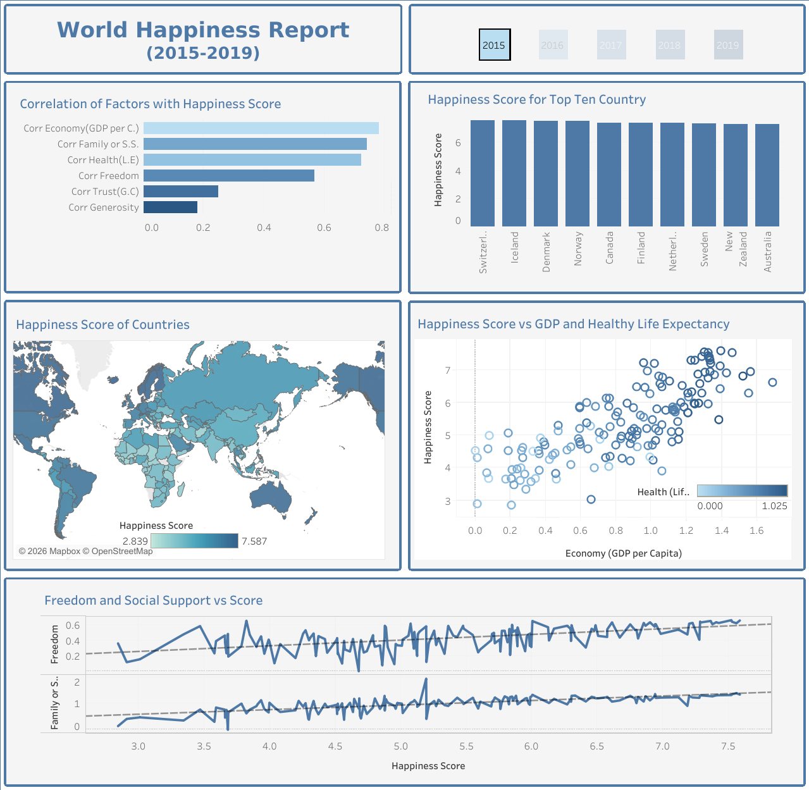
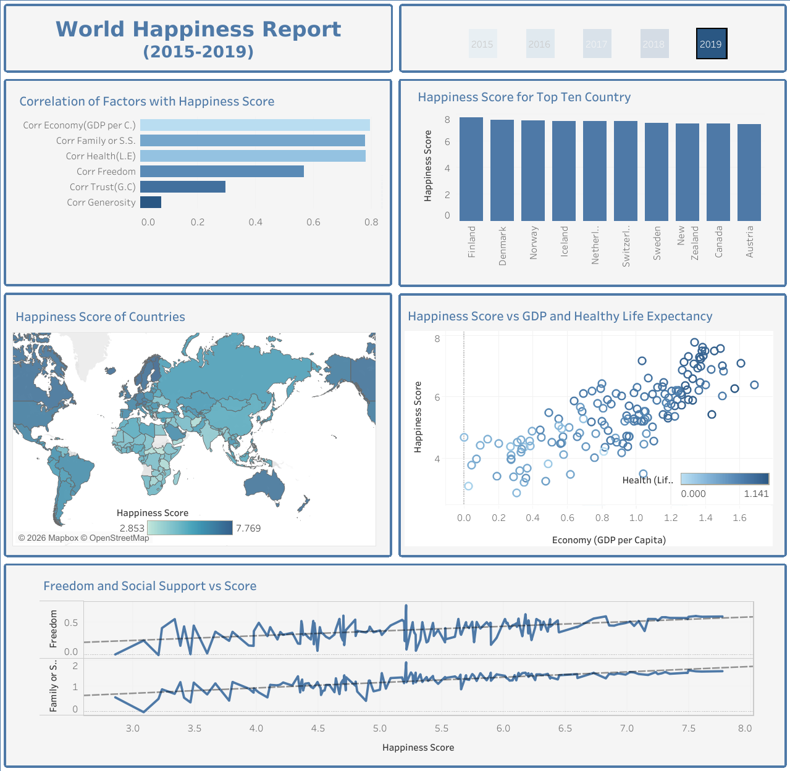

# World Happiness Report 2015–2019: Analysis & Interactive Dashboard

Exploratory analysis of the World Happiness Report (2015–2019), combining five
yearly datasets with inconsistent schemas into a single analysis-ready table,
followed by EDA in pandas and an interactive Tableau dashboard.

**[▶ Interactive Tableau Dashboard](https://public.tableau.com/views/WORLDHAPPINESSREPORT2015-2019_17821369701280/Dashboard1)** · **[Kaggle Notebook](https://www.kaggle.com/code/lemanzgemutluolu/world-happiness-report-2015-2019-eda-correlati)** · **[Slide Deck (PPTX)](./World_Happiness_Report_2015-2019.pptx)**

## Overview

Each year of the World Happiness Report is published as a separate CSV with a
different schema (e.g. a `Region` column present in 2015–2016 but missing in
later years, differently-named score/rank columns per year, extra
uncertainty columns that only exist for some years). This project:

1. **Merges** the five yearly datasets into one consistent table using
   `pandas` — schema alignment, country-based region backfill, manual
   correction for renamed countries (`notebooks/birlestir.ipynb`).
2. **Explores** the merged data (EDA) to identify which factors are most
   strongly associated with happiness scores, and how rankings shift year
   over year (`notebooks/analiz.ipynb`).
3. **Visualizes** the findings in an interactive, year-filterable Tableau
   Public dashboard, and summarizes them in a slide deck.

## Data Source

- [World Happiness Report, 2015–2019 (Kaggle)](https://www.kaggle.com/datasets/unsdsn/world-happiness)
- 782 country-year rows (150+ countries, 5 years), 12 core variables:
  Happiness Score, Rank, GDP per Capita, Family/Social Support, Health (Life
  Expectancy), Freedom, Trust (Government Corruption), Generosity, Dystopia
  Residual.

## Method

| Step | Tool | Notebook |
|---|---|---|
| Data collection | 5 separate yearly CSVs (Kaggle) | — |
| Cleaning & merging | `pandas` — schema alignment, region backfill, `concat` | [`birlestir.ipynb`](./notebooks/birlestir.ipynb) |
| Exploratory analysis | `pandas`, `matplotlib`, `seaborn` — correlation, distributions | [`analiz.ipynb`](./notebooks/analiz.ipynb) |
| Visualization | Tableau Public — interactive, year-filtered dashboard | — |

**A methodological note worth calling out:** correlation between each factor
and happiness score was computed *per year* and then averaged, rather than
on the five years pooled together. Pooling years first understates
`social_support`'s relationship with happiness (0.65 vs. its true ~0.75)
because year-to-year mean shifts blur the within-year signal — a small
Simpson's-paradox-like effect. Averaging five clean, single-year
correlations gives the more reliable picture (see `analiz.ipynb` for the
full comparison).

## Key Findings

- **Nordic and Western European countries dominate the top 10** across all
  five years (Finland, Denmark, Norway, Iceland, Switzerland, Netherlands,
  Sweden), alongside Canada, New Zealand, and Australia.
- **Finland took the #1 spot starting in 2018** and held it through 2019.
- **GDP per capita (avg. corr. 0.80), Social Support (0.75), and Healthy
  Life Expectancy (0.77)** are the strongest and most consistent correlates
  of happiness score, every single year from 2015–2019.
- **Freedom (0.56)** is a moderate, consistent correlate.
- **Trust/perceived corruption (0.40) and Generosity (0.14) are consistently
  the weakest correlates** — a pattern that holds throughout 2015–2019.
- The relationship between GDP and happiness is **positive but not linear**:
  countries with similar GDP per capita can have noticeably different
  happiness scores, meaning economic output alone doesn't fully explain the
  outcome.
- **Regional gap:** Australia/New Zealand and North America average the
  highest happiness scores (~7.2–7.3); Sub-Saharan Africa and Southern Asia
  average the lowest (~4.2–4.6).
- **Turkey** fluctuated in a narrow band (5.33–5.50) across all five years,
  peaking in 2017 (rank 69, score 5.50) with no clear upward or downward
  trend.

## Dashboard Preview

| 2015 | 2019 |
|---|---|
|  |  |

All five yearly views (2015–2019) are in [`/images`](./images).

## Repository Contents

```
world-happiness-report-2015-2019/
├── README.md
├── World_Happiness_Report_2015-2019.pptx   # Summary slide deck
├── notebooks/
│   ├── birlestir.ipynb                     # Merge 5 yearly CSVs -> one table
│   └── analiz.ipynb                        # EDA: correlation, top 10, GDP scatter, region & country trends
├── data/
│   └── world_happiness_2015_2019.csv       # Merged, verified output (782 rows)
└── images/                                 # Dashboard screenshots, 2015–2019
```

## Tools

`Python` · `pandas` · `matplotlib` · `seaborn` · `Jupyter Notebook` · `Tableau Public`

---
**Author:** Leman Özge Mutluoğlu — [Data Analytics Portfolio](https://github.com/ozgemutluoglu/data-analytics-portfolio)
**Project team:** Esma Nur Kaşram · Hilal Emen Balcı · Şeyma Türköner · Eslem Hanım
